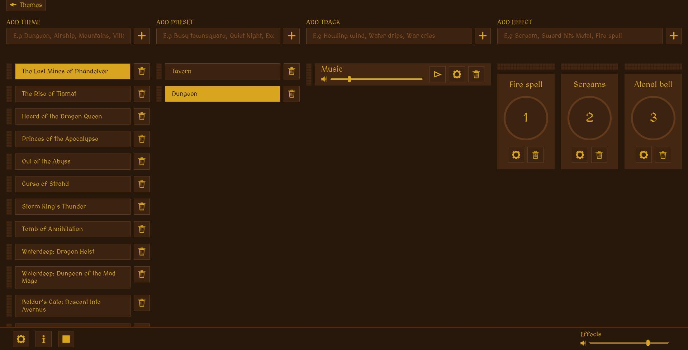

# Dungeon Master Player
<b>Warning: Pre-Alpha version - not all functionality is implemented yet.</b>

## Use case:
### Using for table play
You play Dungeons and Dragons, and want to play layered tracks of music, ambience and sound effects.
You already have a local library of music, soundtracks and sound effects, or know how to get it.

Apart from one music sample and one sound effect sample, there is no audio packs or sets included with this software. If you need pre-compiled audio sets and effects that are ready to go, <a href="https://syrinscape.com/subscriptions/3-supersyrin/">Syrinscape</a> might be a better option.

### Using for online play:
There are programs that can patch the audio from an application, into whatever output you require.

I've not yet found time to experiment with this, but this seems like a good start: https://vb-audio.com/Cable/

## How to install:
First, download this repo 
PHP is required, so go ahead and install that, see below for instructions. 

On Windows, use dmplayer.bat (coming soon) 
On Linux and MacOS, use dmplayer.sh

### Install PHP (windows):
- Right-click install-php.bat and select "Run as administrator".
- Start dmplayer.bat

If you'd rather do it manually:
- Download the most recent <a href="https://windows.php.net/download">php</a> zip-file
- Unzip anywhere, but remember the directory
- <a href="https://www.computerhope.com/issues/ch000549.htm">Add that directory to PATH</a>
- Start dmplayer.bat

#### Troubleshooting
- You may need to restart the machine, so windows can see the new path-variable we just added
- Right click folder, select properties, and turn off read only

If you have issues with any of these, please create an issue and attach a screenshot of what happens.

### Install PHP (linux):
`sudo apt update && sudo apt upgrade` 
`sudo apt install software-properties-common` 
`sudo add-apt-repository ppa:ondrej/php` 
`sudo apt update` 
`sudo apt -y install php` 
Verify installation: 
`php -v` 
If you get back a version number, you're good to go.

## How to use it
First, feel free to delete the sample theme, by clicking the minus symbol next to the theme-name. Now, create your own theme by writing something in the first textbox and pressing the button with a plus icon.

A default preset is automatically added. You can double click on the title (any title, actually) to change it to something else. A preset contains all the volume settings you make for the tracks, and which tracks should be playing for a given preset. If you select different presets it will fade out tracks that are no longer playing, and fade the volume sliders into the preset position.

Add a track by following the same procedure, filling out the text box, and clicking the adjacent button with the plus icon. Tracks are a little different, in that they contain the actual music or ambience files.

To add a file, click the button with an eye icon, which will display a popup. Press the "add file to track"-button to select a file. It will get added to the track. If you have multiple files on a track, the program will randomize which one to get, everytime a track plays, or ends.

Effects are essentially just tracks too, but they are not looped. They are automatically assigned to keyboard shortcuts, so you can play them at the touch of a button. The shortcut is displayed to the left of the effect title, so you can see the shortcut at a quick glance in the heat of battle.

## How it works:
The program spins up a local web server, with PHP.
Data is saved to a locally database-file, that's where your all your themes, presets and tracks are saved.
When you add a file to a track, it is automatically copied to the audio folder.

## Credits:
Included are two example files: 
<a href="https://www.youtube.com/@dndscapes4824">DNDScapes</a> - Three Horses 
<a href="https://freesound.org/people/Sheyvan/">Sheyvan</a> - Orchestral Victory Fanfare